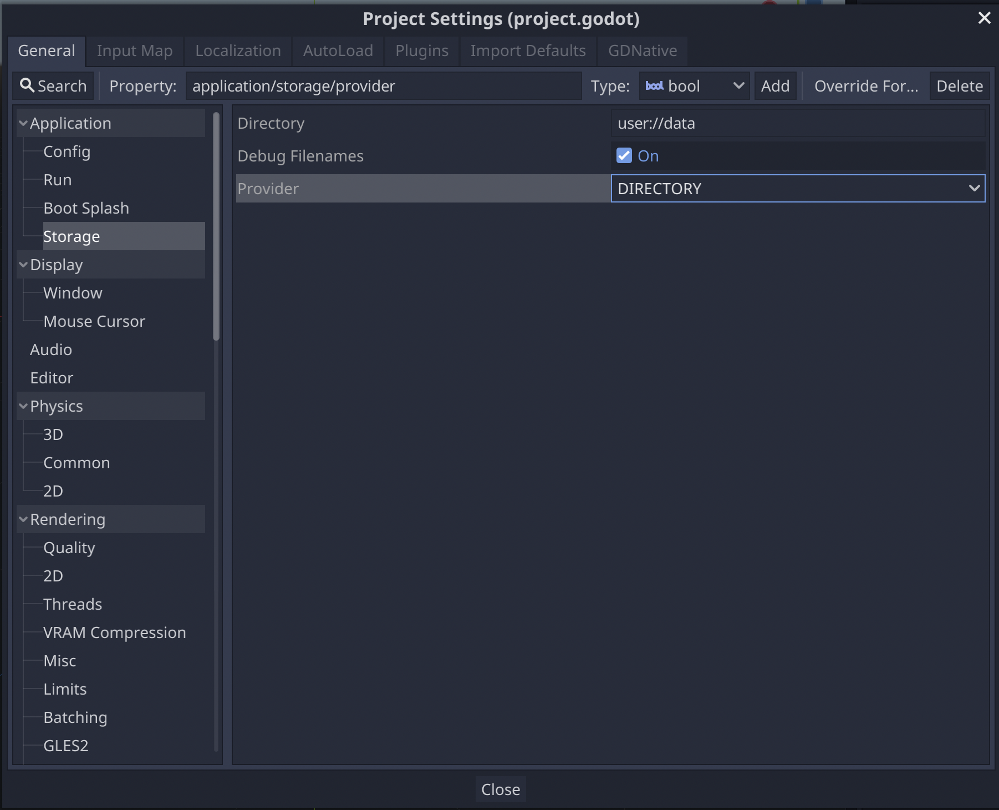

# EZStorage


Easily store/fetch data using key-value storage.

* [EZStorage](#EZStorage-API)
  * A low-level key-value storage using the file system.
  * Store/Fetch anything that would work with `var2str`.
  * Replication logic can prevent corrupted files.
* [EZCache](#EZCache-API)
  * An efficient in-memory cache that only loads files once.
  * Includes events for receiving updates when values change.

## Settings

Settings can be found under application/storage in the project settings.



### Directory

The directory used to save the data. It should be at least in `user://` and by default is `user://data`.

If you need to further customize the directory use `EZStorage.set_directory_suffix(unique_id)`. This is useful to support multiple users.

### Debug Filenames

When enabled file names will use html encoding making it easier to debug the files created.
This feature can be disabled to use filenames that would be used in release mode.

### Provider

The system used for saving data.

#### Directory

Saves data using folders. This is a reliable and quick method but creates many files on your system. It may not be ideal in some situations like with cloud saves.

#### File

Saves data using a fixed number of files, currently 2, but it's slower and wastes memory compared to Directory.

#### Comparison

| **Provider**   | **Status**   | **Storage** | **Performance** | **Files**                 | **Folders**                                     |
|----------------|--------------|-------------|-----------------|---------------------------|-------------------------------------------------|
| _Directory_    | Stable       | Medium      | Medium          | 2 for each key+value pair | 1 for each key+value pair 1 for each unique key |
| _Directory V2_ | Planned      | Small       | Fast            | 1 for each key+value      | 1 for each unique key                           |
| _Files_        | Planned      | Medium      | Medium          | 1 for each key            | 1                                               |
| _File_         | Experimental | Large       | Slow            | 2                         | 1                                               |

## API

### EZStorage API

A low-level key-value storage using the file system.

```gdscript
# Setup a custom directory, do this before storing/fetching data
EZStorage.set_directory_suffix(steam_id)

# Store a value.
EZStorage.store("my_section", "my_key", "my_value")


# Fetch a value, return null if key does not exist.
EZStorage.fetch("my_section", "my_key")

# Fetch a value, return "my_default" if key does not exist
EZStorage.fetch("my_section", "my_key", "my_default")


# Delete all data in "my_section/my_key".
EZStorage.purge("my_section", "my_key")

# Delete all data in "my_section".
EZStorage.purge("my_section")

# Delete all data.
EZStorage.purge()
```

### EZCache API

An efficient in-memory cache that only loads from storage once.

```gdscript
# Create a cache.
var my_section = EZCache.get_section("my_section")


# Store a key in the cache.
my_section.store("my_key", "my_value")


# Fetch a value, return null if key does not exist.
var my_value = my_section.fetch("my_key")

# Fetch a value, return "my_default" if key does not exist.
var my_value = my_section.fetch("my_key", "my_default")

# Fetch a value, return "my_default" if key does not exist. Will set "my_default" in the cache for future fetching.
var my_value = my_section.fetch("my_key", "my_default", true)]


# Delete all keys in my_section except those listed
my_section.purge(["skipped_key"])

# Delete all sections in cache except those listed
EZCache.purge(["skipped_section"])


# Yield until a key is changed on the cache
var key = yield(my_section, "changed")
print("The following key changed in my_section: ", key)

# Connect method and listen to key change events
function _key_changed(key: String) -> void:
  print("The following key changed in my_section: ", key)
my_section.connect("changed, self, "_key_changed")
```

# Example

[Pokaban](http://s.team/a/1937170?utm_source=github&utm_campaign=ezstorage) uses signals from `EZCache` to update the level select screen by adjusting the stars displayed after beating stages.


